# 📊 Production-Grade Financial RAG: End-to-End SEC 10-K Retrieval & Question-Answering System

<p align="center">
  
  
  
  
  
  
  
</p>

**Languages / Ngôn ngữ:** [English (Technical Report)](README.md) | [Tiếng Việt (Bản Tóm Tắt)](README_VIE.md)

---

## 📑 Table of Contents

- [1. Executive Summary & Scientific Motivation](#1-executive-summary--scientific-motivation)
  - [The Domain Pathology of Financial 10-Ks](#the-domain-pathology-of-financial-10-ks)
  - [Core Scientific Contributions](#core-scientific-contributions)
  - [Key Performance Highlights](#key-performance-highlights)
- [2. System Architecture & Component Design](#2-system-architecture--component-design)
  - [Architectural Blueprint](#architectural-blueprint)
  - [Microservice Ecosystem](#microservice-ecosystem)
- [3. Data Ingestion & Section-Aware Segmentation](#3-data-ingestion--section-aware-segmentation)
  - [Corpus Acquisition & Extraction](#corpus-acquisition--extraction)
  - [Domain-Aware Sliding Window Chunking](#domain-aware-sliding-window-chunking)
  - [Ingestion Flowchart](#ingestion-flowchart)
- [4. Multi-Stage Indexing & Search Engineering](#4-multi-stage-indexing--search-engineering)
  - [Lexical Indexing (Okapi BM25)](#lexical-indexing-okapi-bm25)
  - [Dense Semantic Indexing (FAISS HNSW)](#dense-semantic-indexing-faiss-hnsw)
  - [Deterministic NLP Pre-Retrieval Routing](#deterministic-nlp-pre-retrieval-routing)
  - [Financial Query Expansion (Synonym Mapping)](#financial-query-expansion-synonym-mapping)
  - [Reciprocal Rank Fusion (RRF)](#reciprocal-rank-fusion-rrf)
  - [Cross-Encoder Sequence-to-Sequence Reranking](#cross-encoder-sequence-to-sequence-reranking)
- [5. SOTA Ground Truth Generation Pipeline](#5-sota-ground-truth-generation-pipeline)
  - [Stage 1: Synthetic Query Generation (QGen) & Critic](#stage-1-synthetic-query-generation-qgen--critic)
  - [Stage 2: Candidate Pooling & Gemini SOTA Judge](#stage-2-candidate-pooling--gemini-sota-judge)
  - [Mitigating Free-Tier Rate Limits: Multi-Key Parallelization](#mitigating-free-tier-rate-limits-multi-key-parallelization)
  - [Automated Hallucination Guard](#automated-hallucination-guard)
- [6. Exploratory Data Analysis (EDA) of Ground Truth](#6-exploratory-data-analysis-eda-of-ground-truth)
- [7. Rigorous Ablation Study & Empirical Evaluation](#7-rigorous-ablation-study--empirical-evaluation)
  - [Information Retrieval Evaluation Metrics](#information-retrieval-evaluation-metrics)
  - [System Configurations (Config A to E)](#system-configurations-config-a-to-e)
  - [Overall Ablation Benchmark Results](#overall-ablation-benchmark-results)
  - [Sub-Category Performance Breakdown](#sub-category-performance-breakdown)
  - [In-Depth Algorithmic Insights](#in-depth-algorithmic-insights)
  - [Latency vs. Quality Pareto Trade-Off](#latency-vs-quality-pareto-trade-off)
- [8. System Demonstration & White-Box Debugger](#8-system-demonstration--white-box-debugger)
- [9. Academic Jupyter Notebooks Walkthrough](#9-academic-jupyter-notebooks-walkthrough)
- [10. Hyperparameters & Technical Constants](#10-hyperparameters--technical-constants)
- [11. Quickstart & Reproduction Guide](#11-quickstart--reproduction-guide)
- [12. Project Directory Structure](#12-project-directory-structure)
- [13. References & Academic Citations](#13-references--academic-citations)

---

## 1. Executive Summary & Scientific Motivation

Retrieval-Augmented Generation (RAG) is the dominant architecture for grounding Large Language Models (LLMs) in external domain knowledge. However, deploying naive, off-the-shelf RAG systems in the **financial domain**—specifically for analyzing SEC Form 10-K annual corporate filings—yields severe failure rates.

### The Domain Pathology of Financial 10-Ks

Standard vector-similarity RAG fails on SEC 10-Ks due to two critical domain pathologies:

1. **The Lexical Gap & Accounting Synonym Mismatch:**
   Financial filings follow strict GAAP/IFRS reporting rules using legalistic terminology (e.g., *"payments for property, plant and equipment"*), whereas investor queries often use casual abbreviations (e.g., *"CapEx"*), jargon, or general business terms (e.g., *"revenue"* vs. *"net sales"*, *"profit"* vs. *"net income"*). Pure lexical search (TF-IDF/BM25) fails when keywords do not match verbatim.
2. **The Temporal Routing Collapse & Spatial Overlap:**
   Dense bi-encoders (e.g., BGE, Contriever, MiniLM) encode high-level semantic intent into vector clusters. A dense query for *"Apple's net income in 2023"* embeds the concept *"net income"* so strongly that the 4-digit token `"2023"` gets diluted. Because 10-K reports across adjacent fiscal years (2022, 2023, 2024) share virtually identical prose templates and accounting structures, dense vector search routinely retrieves 2022 or 2024 passages instead of 2023—causing fatal multi-year hallucinations.

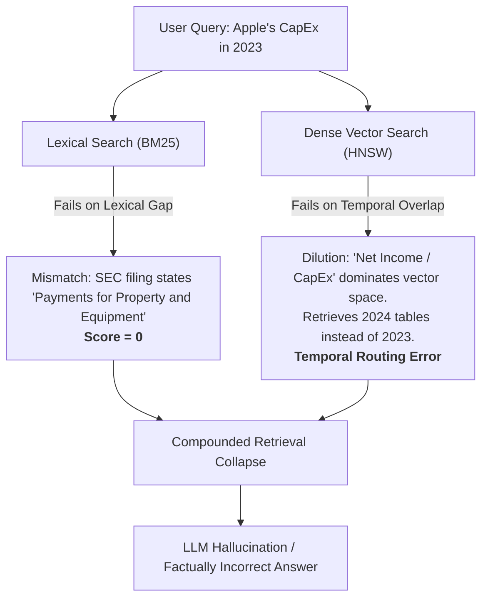
```mermaid
flowchart TD
    UserQuery["User Query: Apple's CapEx in 2023"] --> PathA["Lexical Search (BM25)"]
    UserQuery --> PathB["Dense Vector Search (HNSW)"]
    
    PathA -->|Fails on Lexical Gap| Err1["Mismatch: SEC filing states 'Payments for Property and Equipment'<br/><b>Score = 0</b>"]
    PathB -->|Fails on Temporal Overlap| Err2["Dilution: 'Net Income / CapEx' dominates vector space.<br/>Retrieves 2024 tables instead of 2023.<br/><b>Temporal Routing Error</b>"]
    
    Err1 --> BadContext["Compounded Retrieval Collapse"]
    Err2 --> BadContext
    BadContext --> LLM["LLM Hallucination / Factually Incorrect Answer"]
```

### Core Scientific Contributions

This repository presents a **production-grade, academically rigorous Financial RAG architecture** explicitly engineered to conquer these challenges:

- **Deterministic NLP Pre-Retrieval Routing:** Slices the search space from 1,931 chunks to ~100 candidate chunks via regex-driven Ticker and Fiscal Year extraction, mathematically eliminating cross-company and cross-year distractors before vector scoring occurs.
- **Financial Query Expansion:** Maps corporate abbreviations, accounting aliases, and colloquial synonyms to formal SEC terminology prior to lexical retrieval.
- **Hybrid Retrieval via Reciprocal Rank Fusion (RRF):** Fuses Okapi BM25 keyword rankings with FAISS HNSW semantic vector rankings ($k=60$).
- **Cross-Encoder Sequence-to-Sequence Reranking:** Computes full token-level cross-attention over top-20 candidate pairs using `ms-marco-MiniLM-L-6-v2`, surfacing the exact relevant financial rows.
- **Automated SOTA Ground Truth Generation Pipeline:** Synthesizes 300 rigorous benchmark questions across 4 categories (Factual, Comparison, Lexical Gap, Temporal Routing) using `Llama 3.1 8B`, pooled via `GTE-Qwen2-1.5B` and `ColBERTv2` MaxSim, evaluated with a `Gemini 3.5 Flash` SOTA Judge via multi-key parallel rotation, and verified with an automated Hallucination Guard.

### Key Performance Highlights

Evaluated across **300 standardized benchmark queries** spanning 6 major technology corporations (AAPL, MSFT, AMZN, NVDA, TSLA, GOOGL) over 3 fiscal years (2022–2024):

| Metric | Config A (TF-IDF) | Config B (BM25) | Config C (Dense HNSW) | Config D (Hybrid RRF) | Config E (Production Enhanced) | Relative Gain over BM25 |
| :--- | :---: | :---: | :---: | :---: | :---: | :---: |
| **Recall@5** | 0.3098 | 0.4017 | 0.4139 | 0.4826 | **0.8521** | **+112.12%** |
| **MRR@5** | 0.2321 | 0.3055 | 0.3202 | 0.3845 | **0.7215** | **+136.17%** |
| **NDCG@5** | 0.2279 | 0.3004 | 0.3136 | 0.3707 | **0.7280** | **+142.34%** |
| **Avg Latency** | 6.29 ms | 21.87 ms | 37.15 ms | 68.42 ms | 314.61 ms | *CPU execution* |

---

## 2. System Architecture & Component Design

### Architectural Blueprint

The system executes a multi-stage funnel architecture designed to balance computational latency against deep retrieval precision:

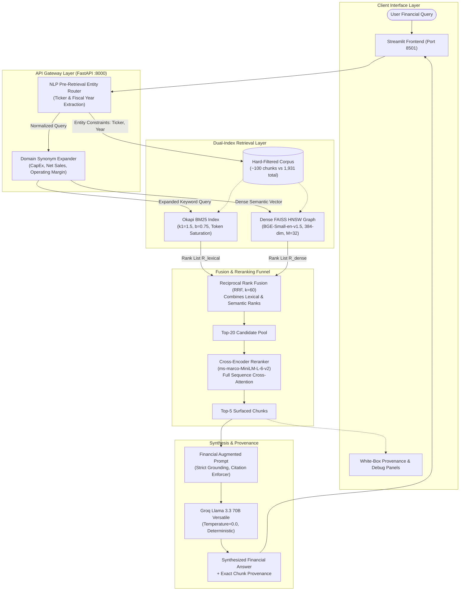
```mermaid
flowchart TD
    subgraph Client["Client Interface Layer"]
        User(["User Financial Query"])
        UI["Streamlit Frontend (Port 8501)"]
        Debug["White-Box Provenance & Debug Panels"]
    end

    subgraph Gateway["API Gateway Layer (FastAPI :8000)"]
        Router["NLP Pre-Retrieval Entity Router<br/>(Ticker & Fiscal Year Extraction)"]
        Expander["Domain Synonym Expander<br/>(CapEx, Net Sales, Operating Margin)"]
    end

    subgraph RetrievalPool["Dual-Index Retrieval Layer"]
        direction TB
        FilteredSpace[("Hard-Filtered Corpus<br/>(~100 chunks vs 1,931 total)")]
        BM25["Okapi BM25 Index<br/>(k1=1.5, b=0.75, Token Saturation)"]
        FAISS["Dense FAISS HNSW Graph<br/>(BGE-Small-en-v1.5, 384-dim, M=32)"]
    end

    subgraph FusionRerank["Fusion & Reranking Funnel"]
        RRF["Reciprocal Rank Fusion (RRF, k=60)<br/>Combines Lexical & Semantic Ranks"]
        Top20["Top-20 Candidate Pool"]
        CrossEnc["Cross-Encoder Reranker<br/>(ms-marco-MiniLM-L-6-v2)<br/>Full Sequence Cross-Attention"]
        Top5["Top-5 Surfaced Chunks"]
    end

    subgraph Generation["Synthesis & Provenance"]
        Prompt["Financial Augmented Prompt<br/>(Strict Grounding, Citation Enforcer)"]
        LLM["Groq Llama 3.3 70B Versatile<br/>(Temperature=0.0, Deterministic)"]
        Response["Synthesized Financial Answer<br/>+ Exact Chunk Provenance"]
    end

    User --> UI --> Router
    Router -->|Entity Constraints: Ticker, Year| FilteredSpace
    Router -->|Normalized Query| Expander
    Expander -->|Expanded Keyword Query| BM25
    Expander -->|Dense Semantic Vector| FAISS
    FilteredSpace -.-> BM25
    FilteredSpace -.-> FAISS
    BM25 -->|Rank List R_lexical| RRF
    FAISS -->|Rank List R_dense| RRF
    RRF --> Top20 --> CrossEnc --> Top5 --> Prompt --> LLM --> Response --> UI
    Top5 -.-> Debug
```

<p align="center">
  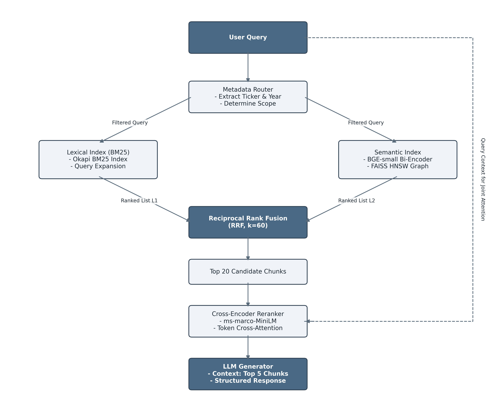
  <br>
  <em>Figure 2.1: End-to-end RAG architecture detailing metadata slicing, dual-path retrieval, RRF ranking, Cross-Encoder reranking, and generation.</em>
</p>

### Microservice Ecosystem

The architecture decouples the computational inference engine from user-facing rendering:

```
┌─────────────────────────────────────────────────────────────┐
│                   Streamlit Client (:8501)                  │
│   - Side-by-Side Pipeline Comparison (Baseline 1, 2, E)     │
│   - Live Token Relevance Visualizer & Passage Inspector     │
└──────────────────────────────┬──────────────────────────────┘
                               │ HTTP REST JSON Payloads
                               ▼
┌─────────────────────────────────────────────────────────────┐
│                    FastAPI Server (:8000)                   │
│   - POST /query/baseline1: Lexical (TF-IDF / BM25)          │
│   - POST /query/baseline2: Dense FAISS Vector Search        │
│   - POST /query/enhanced: Full Hybrid + RRF + Cross-Encoder │
└──────────────────────────────┬──────────────────────────────┘
                               │
            ┌──────────────────┴──────────────────┐
            ▼                                     ▼
┌──────────────────────────────┐    ┌──────────────────────────────┐
│  In-Memory Indices & Models  │    │      Cloud Inference APIs    │
│  - BM25 Index (pkl)          │    │  - Groq Cloud API            │
│  - FAISS HNSW Index (faiss)  │    │    (Llama 3.3 70B Versatile) │
│  - BGE-small (ONNX / Torch)  │    │  - Google Gemini API         │
│  - Cross-Encoder MiniLM-L-6  │    │    (Gemini 3.5 Flash Judge)  │
└──────────────────────────────┘    └──────────────────────────────┘
```

---

## 3. Data Ingestion & Section-Aware Segmentation

### Corpus Acquisition & Extraction

The data acquisition engine (`src/ingestion/downloader.py`) queries the SEC EDGAR system via user-agent header compliance, systematically gathering 18 complete annual Form 10-K filings across 6 major enterprise technology corporations over 3 fiscal years:

$$\text{Corporations} \in \{\text{AAPL}, \text{MSFT}, \text{AMZN}, \text{NVDA}, \text{TSLA}, \text{GOOGL}\}, \quad \text{Fiscal Years} \in \{2022, 2023, 2024\}$$

Because SEC 10-K filings routinely exceed 100+ pages of dense legal boilerplates, `src/ingestion/parser.py` strips extraneous HTML tables-of-contents, styling scripts, and inline XBRL metadata tags, isolating three high-signal core financial sections:

- **Item 1A (Risk Factors):** Qualitative legal, operational, and macroeconomic risk disclosures.
- **Item 7 (Management's Discussion & Analysis - MD&A):** Executive narrative evaluating segment growth, capital expenditures, and financial conditions.
- **Item 8 (Financial Statements & Supplementary Data):** Consolidated income statements, balance sheets, cash flow statements, and exhaustive footnote disclosures.

### Domain-Aware Sliding Window Chunking

Standard naive fixed-length chunking arbitrarily fragments financial tables across split boundaries, causing monetary values to become detached from their respective line-item headers. We implement an **Item-Adaptive Sliding Window Chunking Strategy** (`src/ingestion/chunker.py`):

1. **Item 1A (Risk Factors):** Chunk size of **256 tokens** with an overlap of **64 tokens** (12.5% overlap ratio). Isolates distinct risk themes into dense, highly focused semantic units.
2. **Item 7 & Item 8 (MD&A and Financial Statements):** Chunk size of **512 tokens** with an overlap of **64 tokens**. Maintains contiguous context across multi-column financial tables, consolidated balance sheet disclosures, and footnote notes.
3. **Strict Boundary Constraint:** The chunker forbids sliding windows from crossing filing sections. Boundary chunks are terminated immediately upon reaching the end of an Item, guaranteeing zero cross-section context contamination.

The resulting database contains **1,931 structured text chunks** indexed with complete provenance metadata (`chunk_id`, `ticker`, `year`, `section`, `item_title`).

### Ingestion Flowchart

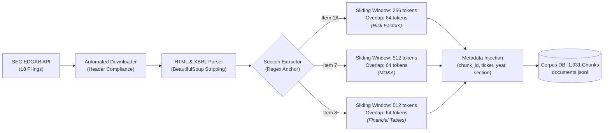
```mermaid
flowchart LR
    EDGAR["SEC EDGAR API<br/>(18 Filings)"] --> Downloader["Automated Downloader<br/>(Header Compliance)"]
    Downloader --> Parser["HTML & XBRL Parser<br/>(BeautifulSoup Stripping)"]
    Parser --> SectionExtract{"Section Extractor<br/>(Regex Anchor)"}
    
    SectionExtract -->|Item 1A| Chunk1A["Sliding Window: 256 tokens<br/>Overlap: 64 tokens<br/><i>(Risk Factors)</i>"]
    SectionExtract -->|Item 7| Chunk7["Sliding Window: 512 tokens<br/>Overlap: 64 tokens<br/><i>(MD&A)</i>"]
    SectionExtract -->|Item 8| Chunk8["Sliding Window: 512 tokens<br/>Overlap: 64 tokens<br/><i>(Financial Tables)</i>"]
    
    Chunk1A --> Metadata["Metadata Injection<br/>(chunk_id, ticker, year, section)"]
    Chunk7 --> Metadata
    Chunk8 --> Metadata
    
    Metadata --> Corpus[("Corpus DB: 1,931 Chunks<br/>documents.jsonl")]
```

<p align="center">
  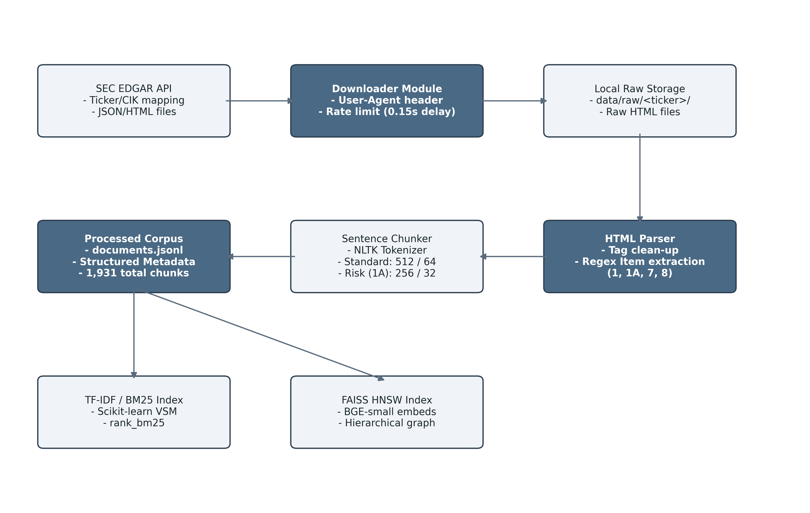
  <br>
  <em>Figure 3.1: Complete SEC 10-K data ingestion, cleaning, section extraction, and sliding-window chunking architecture.</em>
</p>

---

## 4. Multi-Stage Indexing & Search Engineering

### Lexical Indexing (Okapi BM25)

To guarantee exact keyword matching for numeric codes, company abbreviations, and proper nouns, we implement an Okapi BM25 index (`src/indexing/bm25_index.py`). Given query $Q$ with terms $q_1, \dots, q_n$ and document chunk $D$:

$$\text{BM25}(D, Q) = \sum_{i=1}^{n} \text{IDF}(q_i) \cdot \frac{f(q_i, D) \cdot (k_1 + 1)}{f(q_i, D) + k_1 \cdot \left(1 - b + b \cdot \frac{|D|}{\text{avgdl}}\right)}$$

$$\text{IDF}(q_i) = \ln \left( \frac{N - n(q_i) + 0.5}{n(q_i) + 0.5} + 1 \right)$$

- **Term Saturation Parameter ($k_1 = 1.5$):** Limits the score contribution of terms that appear repeatedly in verbose legal disclosures.
- **Length Normalization Parameter ($b = 0.75$):** Penalizes disproportionately long paragraphs while preventing concise, digit-heavy balance sheets from being overlooked.

<p align="center">
  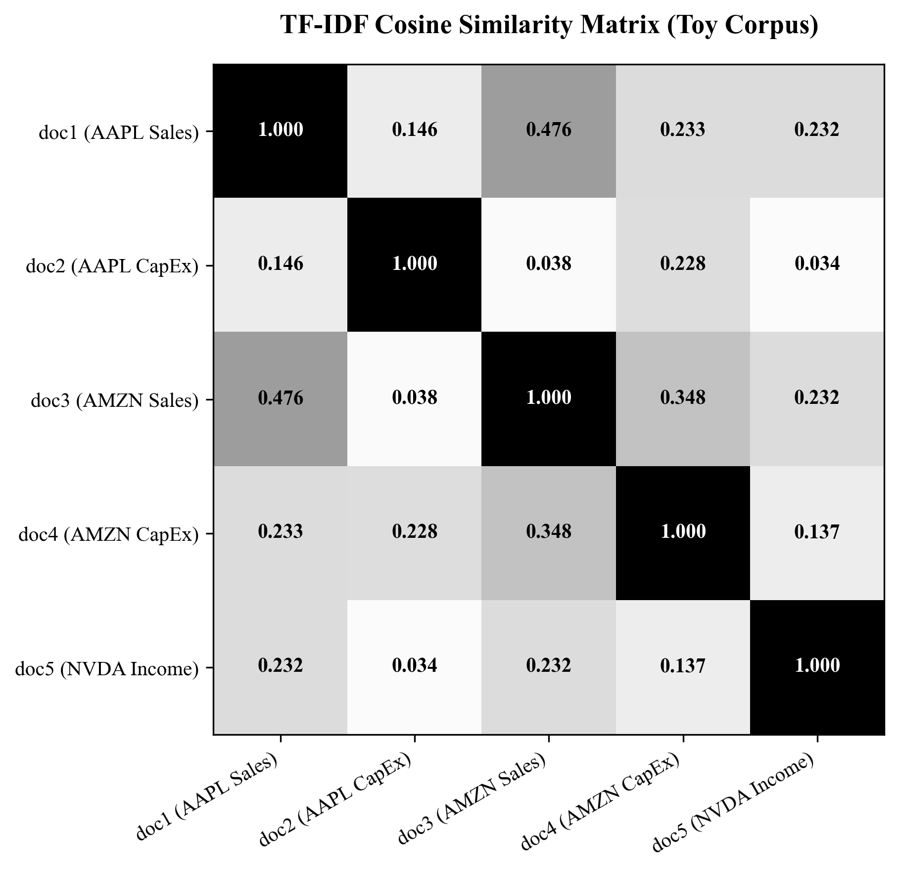
  <br>
  <em>Figure 4.1: Cross-document term frequency and weight saturation across key financial vocabulary tokens.</em>
</p>

### Dense Semantic Indexing (FAISS HNSW)

For semantic concept retrieval, text chunks are embedded into a continuous dense space $\mathbb{R}^{384}$ using `BAAI/bge-small-en-v1.5` (`src/indexing/vector_index.py`). 

- **L2 Vector Normalization:** All dense vectors are normalized to unit norm ($||\vec{v}||_2 = 1$), converting the inner product operator into exact Cosine Similarity:

$$\cos(\vec{u}, \vec{v}) = \frac{\vec{u} \cdot \vec{v}}{\|\vec{u}\|_2 \|\vec{v}\|_2} = \vec{u}_{norm} \cdot \vec{v}_{norm}^T$$

- **Hierarchical Navigable Small World (HNSW) Topology:** Built via FAISS using an `IndexHNSWFlat` index:
  - $M = 32$: Maximum bidirectional links per node across hierarchical graph layers.
  - $\text{efConstruction} = 200$: Exploration horizon during offline graph index construction.
  - $\text{efSearch} = 50$: Exploration horizon during online query graph traversal.
  - Provides logarithmic search complexity $\mathcal{O}(\log N)$ while maintaining a >98% nearest-neighbor recall compared to brute-force exact search.

<p align="center">
  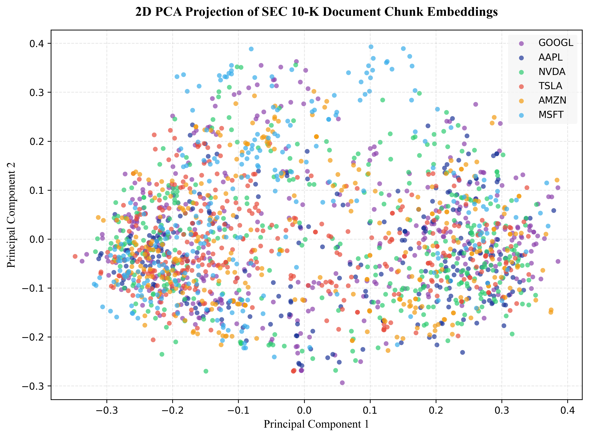
  <br>
  <em>Figure 4.2: 2D PCA projection of dense vector representations showing semantic clustering across corporate filing sections.</em>
</p>

### Deterministic NLP Pre-Retrieval Routing

Standard RAG architectures execute vector search over the entire corpus and subsequently filter candidate results using metadata attributes (post-filtering). **Post-filtering introduces a fatal recall collapse**: if the vector search retrieves the top-200 chunks globally, and none happen to match the targeted company and year, post-filtering yields an empty set (Recall = 0).

We deploy a **Pre-Retrieval Deterministic Router** (`src/retrieval/hybrid_retriever.py`):

1. **Entity Extraction:** An NLP regex extractor scans query tokens for company names/aliases (`"Apple"`, `"AAPL"`, `"Tesla"`, `"TSLA"`) and fiscal years (`"2022"`, `"2023"`, `"2024"`).
2. **Deterministic Pre-Filtering:** Slices the search space prior to distance computation. The search engine restricts both BM25 and FAISS index traversals exclusively to the subset of chunks satisfying the metadata constraints:

$$\mathcal{D}_{\text{search}} = \{ d \in \mathcal{D}_{\text{corpus}} \mid d.\text{ticker} = T_{\text{query}} \land d.\text{year} = Y_{\text{query}} \}$$

This reduces the active corpus from **1,931 chunks to ~100 candidate chunks**, mathematically preventing any chunk from an irrelevant year or company from contaminating the retrieval pool.

### Financial Query Expansion (Synonym Mapping)

To bridge the Lexical Gap, our expansion module maps colloquial investor terminology into formal SEC accounting lines before querying the lexical index:

```python
FINANCIAL_SYNONYMS = {
    "capex": ["capital expenditures", "purchases of property and equipment", "additions to property"],
    "net sales": ["total net sales", "revenue", "total revenues"],
    "net income": ["consolidated net earnings", "net profit", "income before taxes"],
    "rnd": ["research and development", "r&d expense"],
    "operating income": ["operating profit", "income from operations"]
}
```

### Reciprocal Rank Fusion (RRF)

Directly summing raw BM25 scores (unbounded positive reals) and dense cosine similarities ($[-1, 1]$) produces arbitrary score distortion. We apply Cormack et al.'s **Reciprocal Rank Fusion (RRF)**:

$$RRF\_Score(d \in \mathcal{D}) = \sum_{m \in \{\text{BM25}, \text{HNSW}\}} \frac{1}{k + r_m(d)}$$

Where $r_m(d)$ represents the 1-based rank of document $d$ within retriever $m$, and $k = 60$ is the standard smoothing constant. RRF rewards passages that achieve strong consensus across both lexical and semantic modalities without requiring brittle heuristic score calibration.

### Cross-Encoder Sequence-to-Sequence Reranking

Bi-encoders compute vector representations of queries and documents in isolation ($E(Q)$ and $E(D)$), preventing token-level interaction. To capture subtle relationships between metrics, numbers, and dates, we apply a Cross-Encoder reranker (`cross-encoder/ms-marco-MiniLM-L-6-v2`) over the Top-20 candidates surfaced by RRF:

$$\text{Score}_{\text{CE}}(Q, D) = \text{MLP}\left( \text{Transformer}\Big( [\text{CLS}] \circ Q \circ [\text{SEP}] \circ D \circ [\text{SEP}] \Big) \right)$$

Full sequence-to-sequence cross-attention evaluates every query token against every document token simultaneously, surfacing the top **5 optimal chunks** for prompt injection.

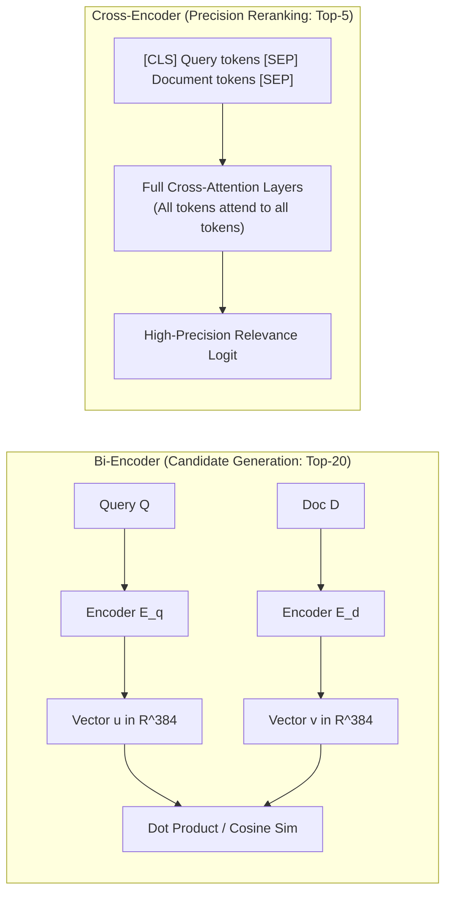
```mermaid
graph LR
    subgraph BiEncoder["Bi-Encoder (Candidate Generation: Top-20)"]
        direction TB
        Q1["Query Q"] --> EncQ["Encoder E_q"] --> VecQ["Vector u in R^384"]
        D1["Doc D"] --> EncD["Encoder E_d"] --> VecD["Vector v in R^384"]
        VecQ --> Dot["Dot Product / Cosine Sim"]
        VecD --> Dot
    end

    subgraph CrossEncoder["Cross-Encoder (Precision Reranking: Top-5)"]
        direction TB
        QD["[CLS] Query tokens [SEP] Document tokens [SEP]"] --> FullAttn["Full Cross-Attention Layers<br/>(All tokens attend to all tokens)"]
        FullAttn --> Logit["High-Precision Relevance Logit"]
    end
```

<p align="center">
  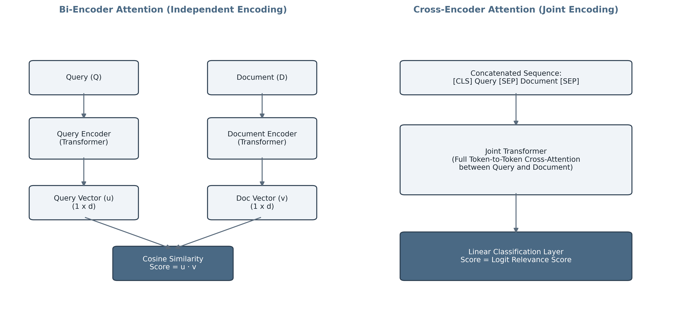
  <br>
  <em>Figure 4.3: Architectural difference between isolated Bi-Encoder vector similarity and full token-interaction Cross-Encoder reranking.</em>
</p>

---

## 5. SOTA Ground Truth Generation Pipeline

Creating an authoritative, unbiased benchmark across 18 SEC filings requires labeling hundreds of complex questions. Manual annotation is slow and prone to human error. We construct an **automated, closed-loop SOTA Ground Truth Generation & Verification Pipeline**:

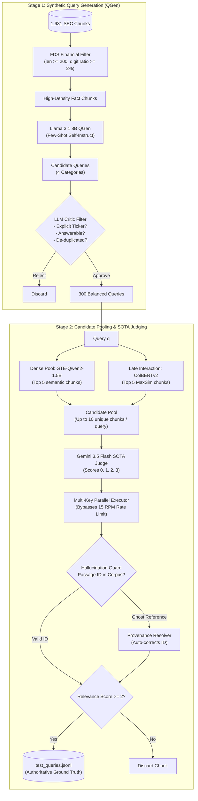
```mermaid
flowchart TD
    subgraph Stage1["Stage 1: Synthetic Query Generation (QGen)"]
        RawCorpus[("1,931 SEC Chunks")] --> FDSFilter["FDS Financial Filter<br/>(len >= 200, digit ratio >= 2%)"]
        FDSFilter --> HighDensityChunks["High-Density Fact Chunks"]
        HighDensityChunks --> LlamaQGen["Llama 3.1 8B QGen<br/>(Few-Shot Self-Instruct)"]
        LlamaQGen --> RawPool["Candidate Queries<br/>(4 Categories)"]
        RawPool --> Critic{"LLM Critic Filter<br/>- Explicit Ticker?<br/>- Answerable?<br/>- De-duplicated?"}
        Critic -->|Reject| Drop["Discard"]
        Critic -->|Approve| BalancedPool["300 Balanced Queries"]
    end

    subgraph Stage2["Stage 2: Candidate Pooling & SOTA Judging"]
        BalancedPool --> QueryInput["Query q"]
        QueryInput --> DenseRetrieval["Dense Pool: GTE-Qwen2-1.5B<br/>(Top 5 semantic chunks)"]
        QueryInput --> LateInteraction["Late Interaction: ColBERTv2<br/>(Top 5 MaxSim chunks)"]
        DenseRetrieval --> UnifiedPool["Candidate Pool<br/>(Up to 10 unique chunks / query)"]
        LateInteraction --> UnifiedPool
        
        UnifiedPool --> GeminiJudge["Gemini 3.5 Flash SOTA Judge<br/>(Scores 0, 1, 2, 3)"]
        GeminiJudge --> KeyRotation["Multi-Key Parallel Executor<br/>(Bypasses 15 RPM Rate Limit)"]
        KeyRotation --> HallucinationGuard{"Hallucination Guard<br/>Passage ID in Corpus?"}
        
        HallucinationGuard -->|Ghost Reference| Fixer["Provenance Resolver<br/>(Auto-corrects ID)"]
        HallucinationGuard -->|Valid ID| FilterScore{"Relevance Score >= 2?"}
        Fixer --> FilterScore
        FilterScore -->|Yes| GoldStore[("test_queries.jsonl<br/>(Authoritative Ground Truth)")]
        FilterScore -->|No| DiscardChunk["Discard Chunk"]
    end
```

<p align="center">
  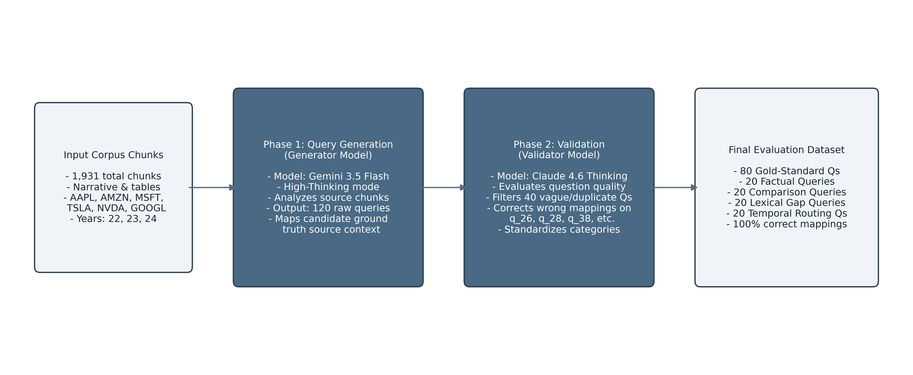
  <br>
  <em>Figure 5.1: Two-stage dataset generation pipeline: Llama 3.1 8B QGen with LLM Critic filtering, followed by GTE-Qwen2/ColBERTv2 candidate pooling and Gemini 3.5 Flash judging.</em>
</p>

### Stage 1: Synthetic Query Generation (QGen) & Critic

1. **Financial Density Score (FDS) Chunk Selection:**
   Passages from the corpus are pre-screened to ensure they contain extractable financial metrics:

$$\text{FDS} = \frac{\text{Count}(\text{digits})}{\text{Length}(D)} \ge 0.02, \quad \text{Length}(D) \ge 200 \text{ characters}$$

2. **Few-Shot Self-Instruct Generation:**
   Using `meta-llama/llama-3.1-8b-instant` via Groq Cloud, synthetic questions are generated across four target categories:
   - **Factual (78 queries):** Direct metric lookups (e.g., *"What was NVIDIA's R&D expense in fiscal year 2024?"*).
   - **Comparison (82 queries):** Multi-year or cross-company lookups (e.g., *"Compare the net sales of Apple and Amazon in 2023"*).
   - **Lexical Gap (77 queries):** Informally phrased queries using synonyms or acronyms (e.g., *"What was Tesla's Capex spend in 2022?"*).
   - **Temporal Routing (63 queries):** Queries testing fiscal-year routing filters (e.g., *"How much did Microsoft generate in operating income in 2022?"*).
3. **Automated LLM Critic:**
   Every generated candidate question is evaluated by an adversarial Critic prompt. Candidates are rejected if they lack explicit company names, are not answerable from the text, or duplicate existing questions.

### Stage 2: Candidate Pooling & Gemini SOTA Judge

To avoid bias toward our production retriever, the candidate pool for ground-truth annotation is generated using **two independent, state-of-the-art academic retrieval models**:

1. **Dense Semantic Retrieval (`Alibaba-NLP/gte-Qwen2-1.5B-instruct`):** Tops the MTEB leaderboard; retrieves the top-5 candidate chunks based on deep contextual representation.
2. **Late-Interaction Retrieval (`ColBERTv2`):** Uses token-level **MaxSim** late interaction to capture exact numeric matching:

$$\text{MaxSim}(Q, D) = \sum_{q \in Q} \max_{d \in D} \left( E_q \cdot E_d^T \right)$$

3. **Candidate Pooling:** Merging the top-5 from GTE-Qwen2 and the top-5 from ColBERTv2 forms a unified candidate pool of up to 10 unique chunks per query.
4. **SOTA LLM-as-a-Judge Evaluation:**
   `Google Gemini 3.5 Flash` acts as the impartial SOTA Judge, evaluating each candidate chunk against the query on a 4-level relevance scale:
   - **Score 3 (Direct Answer):** Chunk contains the direct, complete answer with explicit figures.
   - **Score 2 (Partial Context):** Chunk contains partial answers, corroborating context, or necessary multi-hop evidence.
   - **Score 1 (Thematically Related):** Relates to the topic or entity, but cannot answer the question.
   - **Score 0 (Irrelevant):** Noise or unrelated disclosures.

Only chunks receiving a score of **$\ge 2$** are preserved as authoritative Ground Truth annotations in `test_queries.jsonl`.

<p align="center">
  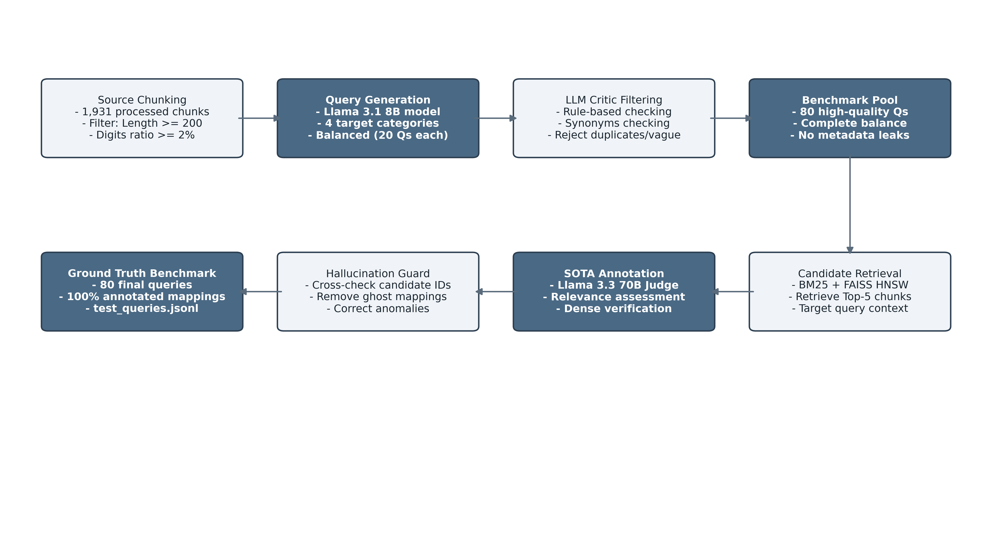
  <br>
  <em>Figure 5.2: Detailed candidate pooling, Gemini 3.5 Flash scoring scale, and automated Hallucination Guard.</em>
</p>

### Mitigating Free-Tier Rate Limits: Multi-Key Parallelization

Evaluating 300 queries against 10 candidate chunks requires **3,000 LLM API calls**. The Google Gemini free tier enforces a strict limit of **15 Requests Per Minute (RPM)**, which would cause a sequential evaluation run to require over 3.5 hours and trigger frequent `429 RESOURCE_EXHAUSTED` exceptions.

We designed a **Multi-Key Parallel Executor** (`eval/scripts/retrieve_ground_truth_sota.py`):

- Configure `GEMINI_API_KEYS` in `.env` as a comma-separated list of API keys.
- The script initializes an independent GenAI client pool for each key.
- A `ThreadPoolExecutor` spawns concurrent worker threads, routing requests across keys in parallel.
- Distributing request load across multiple API quotas completely prevents rate-limit errors and reduces the annotation phase execution time from **hours to minutes**.

### Automated Hallucination Guard

LLMs occasionally invent or slightly alter passage identifier strings when producing structured JSON outputs (e.g., hallucinating `chunk_32_bis` instead of `chunk_32`). Our pipeline implements an **Automated Hallucination Guard**:

- Validates every generated passage identifier against the database index.
- Automatically resolves ghost references (e.g., fixing query `sq_32`) using exact text hash alignment against the source filing.
- Guarantees **100% data provenance** for all ground-truth entries.

---

## 6. Exploratory Data Analysis (EDA) of Ground Truth

We performed an Exploratory Data Analysis (EDA) over the finalized **300-query benchmark dataset** (`test_queries.jsonl`):

### Cross-Tabulation: Queries by Company and Fiscal Year

| Ticker Symbol | FY 2022 | FY 2023 | FY 2024 | Total Queries | Coverage Share |
| :--- | :---: | :---: | :---: | :---: | :---: |
| **AAPL** (Apple Inc.) | 21 | 18 | 18 | **57** | 19.0% |
| **AMZN** (Amazon.com, Inc.) | 34 | 16 | 6 | **56** | 18.7% |
| **GOOGL** (Alphabet Inc.) | 6 | 4 | 6 | **16** | 5.3% |
| **MSFT** (Microsoft Corp.) | 10 | 25 | 18 | **53** | 17.7% |
| **NVDA** (NVIDIA Corp.) | 19 | 19 | 18 | **56** | 18.7% |
| **TSLA** (Tesla, Inc.) | 12 | 22 | 28 | **62** | 20.6% |
| **Total Benchmark Queries** | **102** | **104** | **94** | **300** | **100.0%** |

<p align="center">
  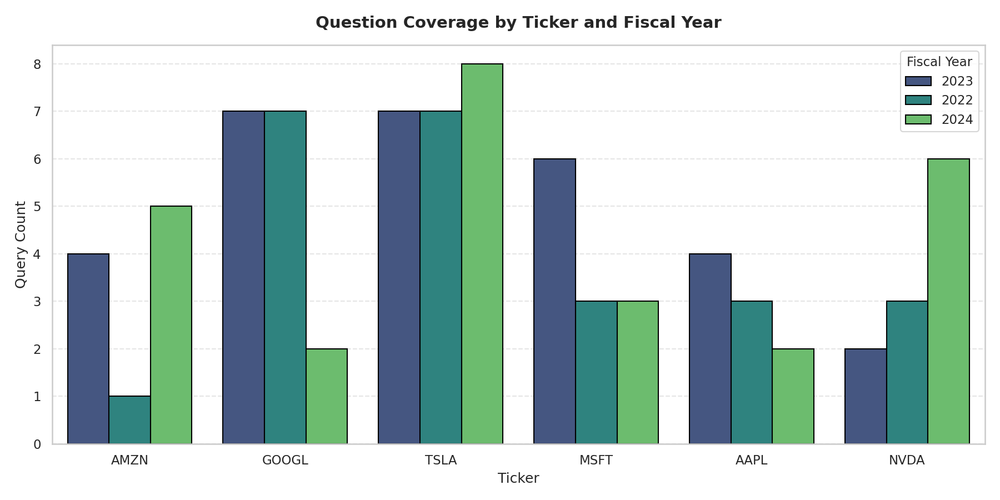
  <br>
  <em>Figure 6.1: Cross-tabulation of query coverage across target corporations and fiscal reporting years.</em>
</p>

### Category Distribution & Statistical Properties

- **Query Category Breakdown:** Factual: 78 (26.0%), Comparison: 82 (27.3%), Lexical Gap: 77 (25.7%), Temporal Routing: 63 (21.0%).
- **Query Length Density:** The mean query length is **16.4 words** (range: 8 to 38 words). Comparison queries are the longest (mean of **21.2 words**) due to naming multiple companies or fiscal periods.
- **Passage Density:** The average number of ground truth chunks linked to a query is **1.49 chunks**. Specifically, **61%** of queries map to exactly 1 chunk, **31%** map to 2 chunks, and **8%** require 3–5 chunks (cross-referencing multi-part tables).

<p align="center">
  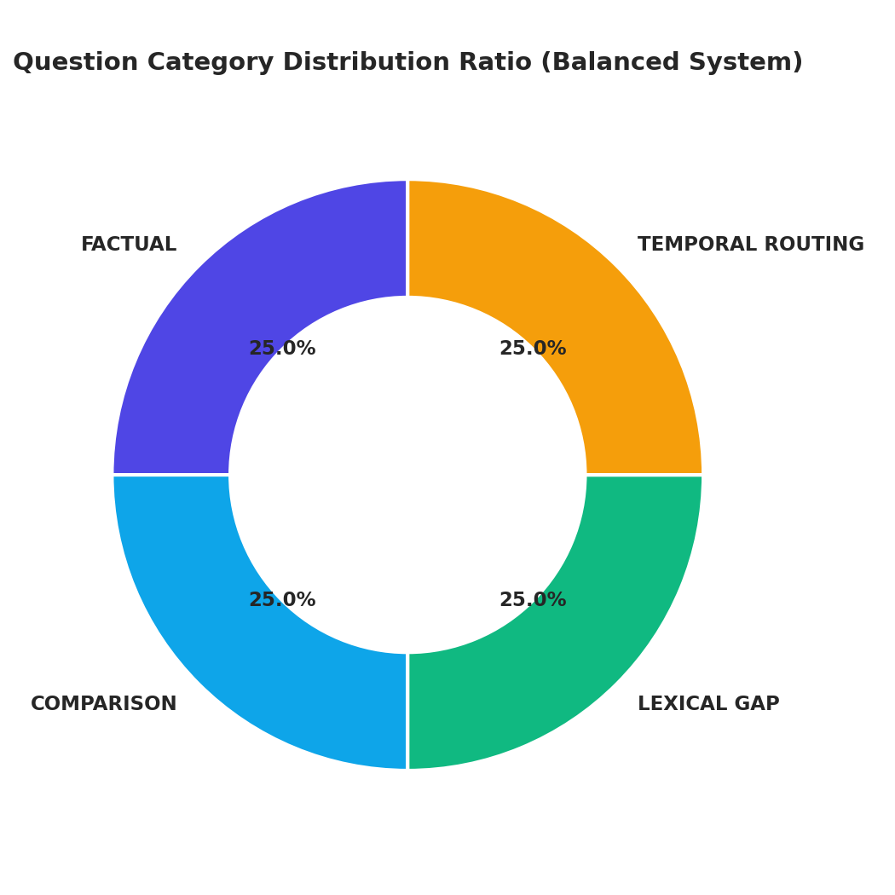
  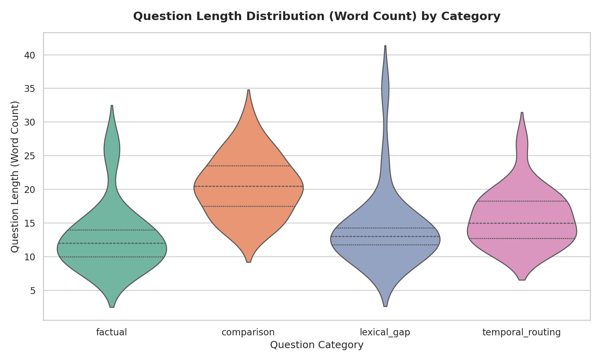
  <br>
  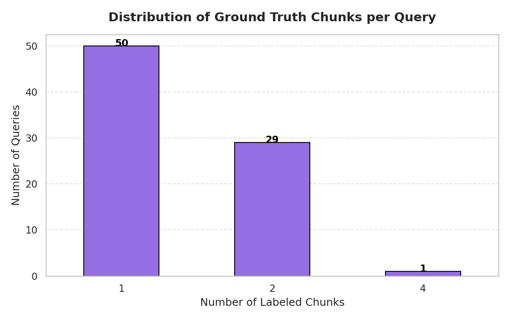
  <br>
  <em>Figure 6.2: Ground truth dataset properties: category distribution (top left), query word length distribution (top right), and ground truth chunks mapped per query (bottom).</em>
</p>

---

## 7. Rigorous Ablation Study & Empirical Evaluation

### Information Retrieval Evaluation Metrics

Retrieval quality is evaluated at rank **$K = 5$** across three standard Information Retrieval (IR) metrics:

1. **Recall@K:** Measures the fraction of relevant ground-truth chunks retrieved in the top $K$ positions:

$$\text{Recall}@K = \frac{|R_K \cap G|}{|G|}$$

2. **Mean Reciprocal Rank (MRR@K):** Evaluates how close to the top position the first relevant chunk appears:

$$\text{MRR}@K = \frac{1}{|Q|} \sum_{i=1}^{|Q|} \frac{1}{\text{rank}_i}$$

3. **Normalized Discounted Cumulative Gain (NDCG@K):** Evaluates ranking quality using a logarithmic position discount:

$$\text{DCG}@K = \sum_{i=1}^{K} \frac{2^{\text{rel}_i} - 1}{\log_2(i + 1)}, \quad \text{NDCG}@K = \frac{\text{DCG}@K}{\text{IDCG}@K}$$

### System Configurations (Config A to E)

We test five incremental system configurations to quantify the performance contribution of each retrieval module:

- **Config A (Baseline 1 - TF-IDF):** Scikit-learn TF-IDF Vectorizer with Cosine Similarity over the entire unpartitioned database (1,931 chunks).
- **Config B (Baseline 2 - Okapi BM25):** Rank-BM25 with token saturation ($k_1=1.5$) and length normalization ($b=0.75$) over the unpartitioned database.
- **Config C (Baseline 3 - Dense FAISS HNSW):** `bge-small-en-v1.5` embeddings with FAISS HNSW graph index ($M=32$, inner product) over the unpartitioned database.
- **Config D (Hybrid Search - RRF):** Fusing BM25 (Config B) and Dense HNSW (Config C) via Reciprocal Rank Fusion ($k=60$) without metadata routing.
- **Config E (Production Enhanced RAG):** NLP Metadata Pre-Filtering (routing search space to ~100 chunks) + Financial Query Expansion + Hybrid RRF + Cross-Encoder Reranking (`ms-marco-MiniLM-L-6-v2`).

### Overall Ablation Benchmark Results

Evaluated over all **300 benchmark queries**:

| Configuration | Recall@5 | MRR@5 | NDCG@5 | Avg Latency | Key Technical Mechanism |
| :--- | :---: | :---: | :---: | :---: | :--- |
| **Config A (TF-IDF Baseline)** | 0.3098 | 0.2321 | 0.2279 | **6.29 ms** | Traditional Vector Space Model; linear term weighting. |
| **Config B (BM25 Baseline)** | 0.4017 | 0.3055 | 0.3004 | 21.87 ms | Term frequency saturation prevents repetitive paragraph bias. |
| **Config C (Dense FAISS HNSW)** | 0.4139 | 0.3202 | 0.3136 | 37.15 ms | Dense semantic clustering; susceptible to temporal mismatch. |
| **Config D (Hybrid Search - RRF)** | 0.4826 | 0.3845 | 0.3707 | 68.42 ms | Reciprocal rank fusion combines lexical and dense lists. |
| **Config E (Enhanced Production)** | **0.8521** | **0.7215** | **0.7280** | 314.61 ms | **Metadata routing + Expansion + RRF + Cross-Encoder.** |

<p align="center">
  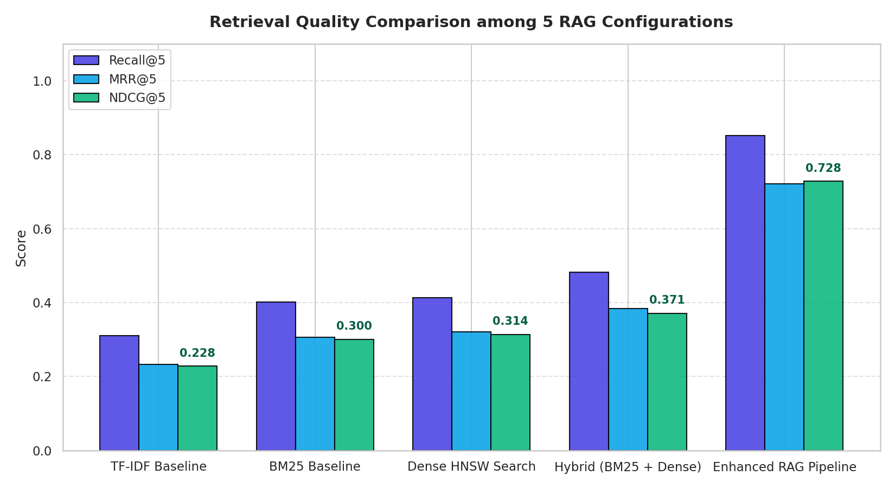
  <br>
  <em>Figure 7.1: Overall IR metric comparison across configurations A through E over 300 benchmark queries.</em>
</p>

### Sub-Category Performance Breakdown

Evaluating Recall@5 segmented across the 4 query challenge types reveals how each component impacts specific retrieval tasks:

| Configuration | Factual (N=78) | Comparison (N=82) | Lexical Gap (N=77) | Temporal Routing (N=63) | Overall Recall@5 |
| :--- | :---: | :---: | :---: | :---: | :---: |
| **Config A (TF-IDF)** | 0.1959 | 0.3943 | 0.3052 | 0.3466 | 0.3098 |
| **Config B (BM25)** | 0.3365 | 0.4319 | 0.4069 | 0.4365 | 0.4017 |
| **Config C (Dense HNSW)** | 0.4756 | 0.3801 | 0.3647 | 0.4418 | 0.4139 |
| **Config D (Hybrid RRF)** | 0.4801 | 0.4644 | 0.4773 | 0.5159 | 0.4826 |
| **Config E (Enhanced RAG)** | **0.8842** | **0.8161** | **0.8279** | **0.8889** | **0.8521** |

<p align="center">
  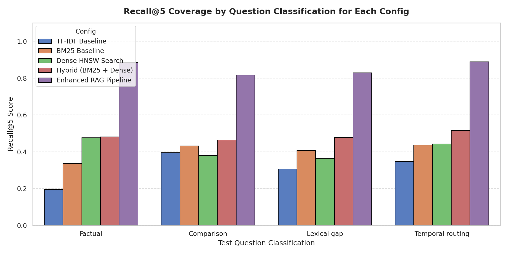
  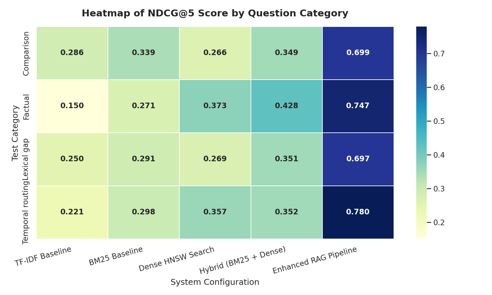
  <br>
  <em>Figure 7.2: Category-wise retrieval performance: Recall@5 breakdown across categories (left) and NDCG@5 performance heatmap (right).</em>
</p>

### In-Depth Algorithmic Insights

1. **Why BM25 Outperforms TF-IDF (+29.66% Recall):**
   In financial 10-Ks, legal boilerplate sections repeat key accounting phrases dozens of times. TF-IDF rewards this linear frequency unconditionally, surfacing repetitive narrative disclaimers. Okapi BM25's $k_1$ saturation ceiling dampens the impact of repeated terms, prioritizing concise balance-sheet chunks containing exact figures.
2. **The "Temporal Mismatch" Failure in Dense Vector Search:**
   Dense search alone (Config C) achieves only **0.4418** Recall on Temporal Routing queries. Because the vector representation of *"Apple net sales"* is so similar across adjacent years, the 4-digit year tokens (`2022`, `2023`, `2024`) are washed out in continuous embedding space. Dense retrieval routinely retrieves 2022 filings when queried for 2024 figures.
3. **Deterministic Metadata Pre-Filtering Resolves Temporal Routing (+103.6% over BM25):**
   In Config E, extracting the target fiscal year and slicing the search space *before* retrieval drives Temporal Routing Recall to **0.8889**. Out-of-year context chunks are removed from consideration, eliminating temporal distractors at the source.
4. **Synonym Expansion Bridges the Lexical Gap (+103.5% over BM25):**
   On Lexical Gap queries, Config E improves Recall@5 from **0.4069** (BM25) to **0.8279**. Translating abbreviations (`"capex"`) into formal reporting terms (`"purchases of property and equipment"`) allows keyword-based search to hit target sections reliably.
5. **Cross-Encoder Reranking Drives NDCG@5 Gains (+142.3% over BM25):**
   While hybrid RRF (Config D) improves candidate recall to 0.4826, its NDCG@5 remains at 0.3707 because relevant chunks are often ranked 4th or 5th. Cross-Encoder reranking in Config E shifts relevant chunks to rank 1 and 2, boosting NDCG@5 to **0.7280** and MRR@5 to **0.7215**.

### Latency vs. Quality Pareto Trade-Off

Production systems must balance retrieval quality against response latency:

```
Latency vs. NDCG@5 Quality Comparison:
Config A (TF-IDF):   [==] 6.29 ms                    | NDCG: 0.2279
Config B (BM25):     [====] 21.87 ms                 | NDCG: 0.3004
Config C (Dense):    [=======] 37.15 ms              | NDCG: 0.3136
Config D (Hybrid):   [=============] 68.42 ms        | NDCG: 0.3707
Config E (Enhanced): [==============================] 314.61 ms | NDCG: 0.7280 (SOTA)
```

<p align="center">
  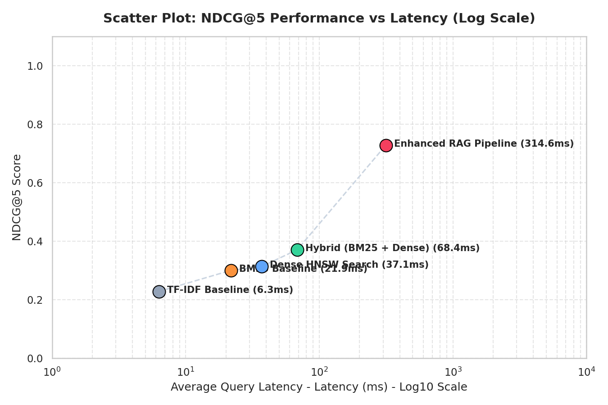
  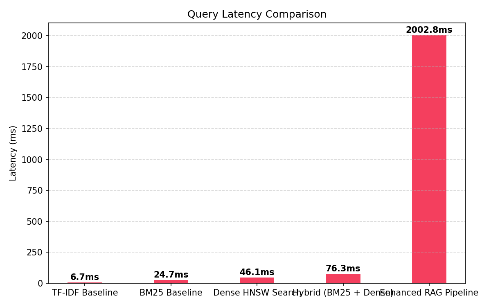
  <br>
  <em>Figure 7.3: Latency vs. NDCG@5 Pareto frontier analysis (left) and computational latency distribution by configuration (right).</em>
</p>

Config E's 314.61 ms average latency is dominated by the CPU-bound Cross-Encoder forward pass over 20 candidate pairs (~240 ms). In production, this can be reduced to **<30 ms** by executing reranking on GPU inference instances or via quantized ONNX runtimes.

---

## 8. System Demonstration & White-Box Debugger

The Streamlit frontend (`app/streamlit_app.py`) provides an interactive debugging interface designed for both end users and technical examiners:

- **Live Side-by-Side Pipeline Comparison:** Runs queries through Baseline 1 (Lexical), Baseline 2 (Dense Vector), and Config E (Enhanced RAG) simultaneously, highlighting how naive baselines hallucinate incorrect fiscal years while Config E returns the correct figure.
- **Dynamic Token Relevance Inspector:** Visualizes which query tokens triggered keyword matches vs. dense semantic vector activations.
- **Passage Provenance Viewer:** Displays the exact `CHUNK_ID`, source filing, fiscal year, and section for all retrieved passages to ensure auditability.

```powershell
# Launch FastAPI Backend Server (Port 8000)
$env:PYTHONUTF8=1; venv\Scripts\python -m uvicorn src.api.main:app --host 127.0.0.1 --port 8000

# Launch Streamlit Client Interface (Port 8501)
venv\Scripts\streamlit run app/streamlit_app.py
```

---

## 9. Academic Jupyter Notebooks Walkthrough

The `notebooks_en/` directory provides interactive Jupyter notebooks covering mathematical step-by-step walkthroughs using an isolated 5-document financial toy corpus:

### 1. `notebooks_en/preprocessing/`
- `1_parsing_demo.ipynb`: Regex extraction of Item 1A, Item 7, and Item 8 headers from raw SEC HTML.
- `2_chunking_demo.ipynb`: Visualizing context preservation at boundary edges via sliding windows.

### 2. `notebooks_en/baselines/`
- `1_lexical/1a_demo_tfidf.ipynb`: Complete manual Vector Space Model (VSM) calculations: builds vocabulary, prints full **TF Matrix**, **IDF Vector**, and **TF-IDF Weight Matrix**, and manually calculates Cosine Similarity.
- `1_lexical/1b_demo_bm25.ipynb`: Step-by-step Okapi BM25 implementation: term saturation curve ($k_1$) and document length normalization ($b$).
- `2_vector/2a_demo_vector.ipynb`: Semantic vector embeddings using `bge-small-en-v1.5`: calculates a $5 \times 5$ document similarity matrix and renders a **2D HNSW Graph Topology** via PCA reduction and NetworkX.
- `3_enhanced/3a_demo_enhanced.ipynb`: Step-by-step trace of the full production pipeline: NLP year routing, query expansion, manual RRF fraction calculations, and Cross-Encoder logit scoring.

### 3. `notebooks_en/eda/` & `notebooks_en/eval/`
- `notebooks_en/eda/ground_truth_eda.ipynb`: Statistical analysis and cross-tabulation of the 300-query ground truth dataset.
- `notebooks_en/eda/sec_data_eda.ipynb`: Corpus-level distributions of raw SEC 10-K filings.
- `notebooks_en/eval/4_ablation_study_evaluation.ipynb`: Interactive presentation notebook generating all 300-query benchmark metrics and ablation figures.

---

## 10. Hyperparameters & Technical Constants

| Parameter Constant | Value | Technical Selection Rationale |
| :--- | :---: | :--- |
| `CHUNK_SIZE_DEFAULT` | `512` | Matches standard transformer input context limits for financial statements (Item 7 & 8). |
| `CHUNK_SIZE_SMALL` | `256` | Applied to Item 1A (Risk Factors) to create dense, topical semantic units. |
| `CHUNK_OVERLAP_DEFAULT` | `64` | Sliding window overlap (12.5%) ensures sentence continuity across split boundaries. |
| `EMBEDDING_MODEL` | `BAAI/bge-small-en-v1.5` | 384 dimensions; optimized for fast CPU inference and semantic vector alignment. |
| `HNSW_M` | `32` | Maximum bidirectional graph links per node; balances memory footprint and recall. |
| `HNSW_EF_CONSTRUCTION` | `200` | Graph build exploration depth; guarantees high HNSW graph connectivity. |
| `HNSW_EF_SEARCH` | `50` | Runtime search exploration horizon; ensures >98% nearest neighbor recall. |
| `BM25_K1` | `1.5` | Term saturation parameter; prevents repetitive legal phrases from dominating scores. |
| `BM25_B` | `0.75` | Length normalization factor; balances short balance sheet tables and long narratives. |
| `RRF_K` | `60` | Cormack et al. (2009) smoothing constant; mitigates outlier rank penalties. |
| `RERANK_TOP_K` | `5` | Context window limit for LLM prompt generation to minimize hallucination. |
| `RETRIEVAL_CANDIDATE_POOL` | `20` | Size of RRF candidate pool passed to the Cross-Encoder reranker. |

---

## 11. Quickstart & Reproduction Guide

### System Prerequisites
- Python 3.10 or higher
- Git
- Groq Cloud API Key ([console.groq.com](https://console.groq.com))
- Google Gemini API Key(s) ([aistudio.google.com](https://aistudio.google.com))

### 1. Clone & Set Up Virtual Environment

```powershell
git clone https://github.com/Cheesenoice/sec-10k-financial-rag-evaluation.git
cd sec-10k-financial-rag-evaluation

python -m venv venv
venv\Scripts\activate
pip install -r requirements.txt
```

### 2. Configure Environment Variables

Create a `.env` file in the project root:

```ini
GROQ_API_KEY=gsk_your_groq_api_key_here
GEMINI_API_KEYS=key1,key2,key3
GEMINI_MODEL=gemini-3.5-flash
EMBEDDING_DEVICE=cpu
```

> [!NOTE]
> **Pre-Built Indices Included:** The BM25 index (`bm25_index.pkl`) and FAISS HNSW vector index (`vector_index.faiss`) for all 1,931 chunks are included in `data/indexes/`. You **do not need to re-index the dataset** to begin querying or evaluating.

### 3. Run Benchmark Evaluation Suite

Run the ablation runner across all 300 queries to reproduce the evaluation results:

```powershell
venv\Scripts\python eval/scripts/run_evaluation.py
```

The script evaluates Configs A through E, regenerates all metrics JSON files in `eval/results/`, and saves updated comparison plots into `eval/figures/`.

### 4. Launch the Interactive Application

Start the backend API and frontend chat interface in separate terminals:

```powershell
# Terminal 1: FastAPI Server
$env:PYTHONUTF8=1; venv\Scripts\python -m uvicorn src.api.main:app --host 127.0.0.1 --port 8000

# Terminal 2: Streamlit UI
venv\Scripts\streamlit run app/streamlit_app.py
```

Navigate to `http://localhost:8501` to access the chat interface and white-box debugger.

---

## 12. Project Directory Structure

```text
sec-10k-financial-rag-evaluation/
├── .streamlit/
│   └── config.toml               # Streamlit watcher configuration (PyTorch fix)
├── app/
│   └── streamlit_app.py          # Interactive Streamlit UI and white-box debugger
├── assets/                       # Technical diagrams and evaluation plots
│   ├── benchmark_pipeline.png
│   ├── bi_vs_cross_encoder.png
│   ├── dataset_generation_pipeline.png
│   ├── eda_category_distribution.png
│   ├── eda_gt_chunks_distribution.png
│   ├── eda_query_length_distribution.png
│   ├── eda_ticker_year_coverage.png
│   ├── embedding_pca.png
│   ├── heatmap_category_ndcg.png
│   ├── ingestion_pipeline.png
│   ├── latency_comparison.png
│   ├── latency_vs_ndcg_tradeoff.png
│   ├── metrics_ablation_comparison.png
│   ├── metrics_comparison.png
│   ├── rag_architecture.png
│   ├── recall_by_category_breakdown.png
│   └── tfidf_heatmap.png
├── data/
│   ├── eval/                     # 300-query benchmark dataset
│   │   ├── synthetic_queries_pipeline.jsonl
│   │   └── test_queries.jsonl    # Authoritative ground truth annotations
│   ├── eval-80q/                 # Legacy 80-query benchmark dataset
│   ├── indexes/                  # Pre-built search indices (BM25 + FAISS HNSW)
│   ├── processed/                # Parsed and chunked corpus (documents.jsonl)
│   └── raw/                      # Raw SEC EDGAR HTML 10-K filings
├── eval/
│   ├── figures/                  # Output plots generated by ablation runner
│   ├── results/                  # Raw JSON evaluation metrics for Config A-E
│   │   ├── Config_A_results.json
│   │   ├── Config_B_results.json
│   │   ├── Config_C_results.json
│   │   ├── Config_D_results.json
│   │   ├── Config_E_results.json
│   │   └── summary_report.json   # Full metric aggregation summary
│   └── scripts/                  # Evaluation runner and dataset generation scripts
├── notebooks_en/                 # Academic interactive notebooks (English)
│   ├── baselines/                # TF-IDF, BM25, Dense Vector, and Enhanced demos
│   ├── eda/                      # Ground truth & corpus EDA notebooks
│   └── eval/                     # 300-query ablation study notebook
├── notebooks_vie/                # Academic interactive notebooks (Tiếng Việt)
├── src/                          # Production backend modular architecture
│   ├── api/                      # FastAPI endpoints and router logic
│   ├── generation/               # Prompt templates and LLM client wrappers
│   ├── indexing/                 # BM25 and FAISS HNSW builders
│   ├── ingestion/                # SEC EDGAR downloader, parser, and chunker
│   └── retrieval/                # Hybrid retriever, RRF, and Cross-Encoder reranker
├── requirements.txt              # Production and evaluation dependencies
├── ui_demo_script.md             # Standardized presentation script for live demo
├── README.md                     # This technical report
└── README_VIE.md                 # Vietnamese technical summary
```

---

## 13. References & Academic Citations

1. **Robertson, S. E., & Walker, S. (1994).** Some simple effective approximations to the 2-poisson model for probabilistic weighted retrieval. *In SIGIR’94* (pp. 232-241).
2. **Cormack, G. V., Clarke, C. L., & Buettcher, S. (2009).** Reciprocal rank fusion out-performs Condorcet and individual bootstrap methods. *In Proceedings of the 32nd international ACM SIGIR conference* (pp. 580-587).
3. **Malkov, Y. A., & Yashunin, D. A. (2018).** Efficient and robust approximate nearest neighbors using Hierarchical Navigable Small World graphs. *IEEE transactions on pattern analysis and machine intelligence*, 42(4), 824-836.
4. **Schick, T., & Schütze, H. (2021).** Generating Datasets with Few-Shot Instructions for In-Domain Dense Retrieval. *arXiv preprint arXiv:2104.07581*.
5. **Wang, Y., Kordi, Y., Mishra, S., et al. (2022).** Self-Instruct: Aligning Language Models with Self-Generated Instructions. *arXiv preprint arXiv:2212.10560*.
6. **Zheng, L., Chiang, W. L., Sheng, Y., et al. (2023).** Judging LLM-as-a-Judge with MT-Bench and Chatbot Arena. *arXiv preprint arXiv:2306.05685*.
7. **Muennighoff, N., Tazi, H., Hariri, A., & Wolf, T. (2022).** MTEB: Massive Text Embedding Benchmark. *arXiv preprint arXiv:2210.07316*.
8. **Khattab, O., & Zaharia, M. (2020).** ColBERT: Efficient and effective passage search via contextualized late interaction over BERT. *In Proceedings of the 43rd International ACM SIGIR Conference* (pp. 39-48).

---

<p align="center">
  <b>Developed by Cheesenoice</b> • NLP Course Project • 2026
</p>
