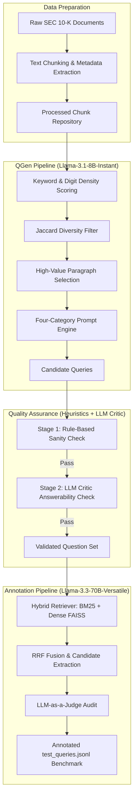

# Synthetic Query Generation & Ground Truth Annotation Methodology

This document details the academic design, mathematical formulations, and engineering workflows of the **Synthetic Query Generation (QGen) Pipeline** and the **Independent Ground Truth Annotation Pipeline** used to build the standardized 80-question evaluation benchmark for our SEC 10-K RAG System.

---

## 1. Complete Academic Flow & Architecture

The system utilizes a dual-engine architecture:
1. **Generator-Critic Pipeline**: Automatically generates diverse, high-value financial questions from raw SEC 10-K filings.
2. **Independent Validator Pipeline**: Retrieves and maps true Ground Truth (GT) source chunks using state-of-the-art (SOTA) cross-encoders and LLM-as-a-Judge to eliminate circular bias.

---

## 2. Phase-by-Phase Technical Methodology

### Phase 2.1: Source Paragraph Selection & Filtering
To ensure the LLM generates realistic questions, the system filters out low-information text blocks (e.g., boilerplate legal warnings, signature pages) and prioritizes dense financial tables and qualitative discussions.

1. **Keyword-Based Relevance Scoring**: Paragraphs are scanned for financial metrics keywords $\mathcal{K}$:
   $$\mathcal{K} = \{\text{revenue, sales, net income, operating expense, capex, R\&D, cash equivalents, total assets}\}$$
2. **Numeric Density Threshold**: To capture tabular data and balance sheets, paragraphs must satisfy a digit-to-character ratio constraint:
   $$\text{Digit Ratio} = \frac{\text{Count of Numeric Digits}}{\text{Total Characters}} \ge 0.02 \quad \land \quad \text{Count of Digits} \ge 20$$
3. **Jaccard Similarity Diversity Filter**: To avoid redundant questions over overlapping passages, a sliding-window Jaccard comparison is performed. If a new candidate chunk $C_{\text{new}}$ has a similarity coefficient $J > 0.5$ with any previously selected chunk $C_{\text{prev}}$ for the same company, it is discarded:
   $$J(C_{\text{new}}, C_{\text{prev}}) = \frac{|W_{\text{new}} \cap W_{\text{prev}}|}{|W_{\text{new}} \cup W_{\text{prev}}|} \le 0.5$$
   *(where $W$ is the set of unique lowercase words in the text).*

### Phase 2.2: Synthetic Query Generation (QGen Engine)
The generation engine is powered by **Llama-3.1-8B-Instant** via Groq Cloud. The prompt engine enforces strict category-based generation templates to capture 4 major retrieval challenges in financial QA:

| Category | Description | RAG Challenge Tested |
| :--- | :--- | :--- |
| **Factual** | Requests a direct, explicit financial figure present in the text. | Single-hop exact-match retrieval. |
| **Comparison** | Compares a metric across years, segments, or target companies. | Multi-hop reasoning and parallel candidate pooling. |
| **Lexical Gap** | Replaces key metrics with industry synonyms (e.g., "capex" for "capital expenditures"). | Semantic mapping vs. exact keyword matching. |
| **Temporal Routing** | Explicitly specifies a target fiscal year (e.g., 2022 vs 2024). | Strict metadata filtering and chronological reasoning. |

### Phase 2.3: Dual-Stage Quality Validation Framework
Every generated candidate query $q$ is subjected to a rigorous two-step validation:

1. **Stage 1 (Rule-Based Heuristic Validator)**:
   * **Length check**: $\text{WordCount}(q) \ge 5$.
   * **Company entity validation**: $q$ must contain the target company name or its ticker synonyms (e.g., "Apple" or "AAPL").
   * **Temporal validation**: For *Temporal Routing*, $q$ must contain the string representation of the target fiscal year.
2. **Stage 2 (LLM Critic - Answerability & Hallucination Check)**:
   The source chunk and query are passed to the LLM Critic with strict instructions. The critic outputs a JSON format assessing two variables:
   $$\text{Answerability} \in \{1, 2, 3, 4, 5\} \quad \land \quad \text{Hallucination} \in \{\text{True}, \text{False}\}$$
   A question is **accepted** if and only if:
   $$\text{Answerability} \ge 4 \quad \land \quad \text{Hallucination} = \text{False}$$
   *(Note: Standard financial synonyms are explicitly whitelisted to prevent false positives in the Lexical Gap category).*

### Phase 2.4: Independent Ground Truth Annotation (Anti-Bias Audit)
Using the retriever under test to annotate ground truth causes **circular evaluation bias** (where the system artificially performs well because it retrieves what it was trained to find). 

To prevent this, we build an **independent annotation pipeline**:
1. **SOTA Hybrid Retrieval**:
   * Lexical candidate retrieval using Okapi BM25.
   * Semantic candidate retrieval using `BAAI/bge-small-en-v1.5` (a top-performing lightweight MTEB model).
   * Fusion using Reciprocal Rank Fusion (RRF) to output the top 20 candidate chunks:
     $$\text{RRF\_Score}(d \in \mathcal{D}) = \frac{1}{k + r_{\text{BM25}}(d)} + \frac{1}{k + r_{\text{Dense}}(d)} \quad (k=60)$$
2. **LLM-as-a-Judge Audit**:
   The top 20 candidates, along with the query, company, and year metadata, are presented to a larger, highly capable model (**Llama-3.3-70B-Versatile**). The judge acts as a professional financial auditor, selecting only the exact chunk IDs that contain the figures or facts required to resolve the question, and outputs its reasoning.

---

## 3. Related Academic Literature & Foundations

The methodology implemented in our pipelines aligns directly with current SOTA research in NLP and Dense Retrieval:

1. **Self-Instruct Framework (Wang et al., 2022)**:
   * *Relation*: Our QGen engine uses a structured prompt to guide the LLM to write queries grounded strictly in source chunks, mirroring the core principles of generating instructions from input contexts.
   * *Citation*: *Wang, Y., Kordi, Y., Mishra, S., Liu, A., Smith, N. A., & Hajishirzi, H. (2022). Self-Instruct: Aligning Language Models with Self-Generated Instructions.*
2. **In-Domain Dataset Generation (Schick & Schütze, 2021)**:
   * *Relation*: Generation of query-passage pairs using generative models to evaluate retrieval performance without human labelling overhead.
   * *Citation*: *Schick, T., & Schütze, H. (2021). Generating Datasets with Few-Shot Instructions for In-Domain Dense Retrieval.*
3. **LLM-as-a-Judge (Zheng et al., 2023)**:
   * *Relation*: Using Llama-3.3-70B as a judge is a validated method to replace expensive human annotations in QA datasets, showing strong correlation with human preferences.
   * *Citation*: *Zheng, L., Chiang, W. L., Sheng, Y., Li, S., Zhuang, H., Wu, Z., ... & Stoica, I. (2023). Judging LLM-as-a-Judge with MT-Bench and Chatbot Arena.*
4. **Reciprocal Rank Fusion (RRF) (Cormack et al., 2009)**:
   * *Relation*: RRF combinesBM25 rankings and Dense retriever rankings in our candidate pooling phase without requiring score normalization.
   * *Citation*: *Cormack, G. V., Clarke, C. L., & Buettcher, S. (2009). Reciprocal rank fusion out-performs Condorcet and individual bootstrap methods.*
5. **Massive Text Embedding Benchmark (MTEB) (Muennighoff et al., 2022)**:
   * *Relation*: Using `BAAI/bge-small-en-v1.5` leverages one of the highest-rated semantic dense embeddings for retrieval tasks on the MTEB leaderboard.
   * *Citation*: *Muennighoff, N., Tazi, H., Hariri, A., & Wolf, T. (2022). MTEB: Massive Text Embedding Benchmark.*
