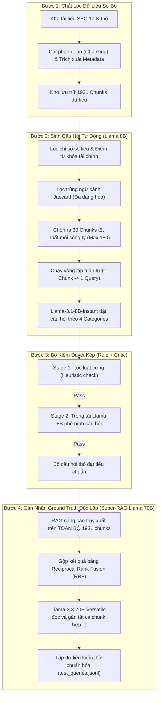

# Phương Pháp Học Thuật: Sinh Dữ Liệu Kiểm Thử (QGen) & Gán Nhãn Ground Truth Tự Động

Tài liệu này mô tả chi tiết toàn bộ luồng hoạt động, công thức toán học, cơ chế kiểm duyệt và gán nhãn Ground Truth (GT) của hệ thống đánh giá Ablation Study trên dữ liệu báo cáo tài chính SEC 10-K. 

---

## 1. Sơ Đồ Luồng Hoạt Động Tổng Thể (Architectural Flowchart)

Toàn bộ quy trình từ tài liệu thô ban đầu đến bộ dữ liệu kiểm thử hoàn chỉnh (`test_queries.jsonl`) được thiết kế qua hai pipeline độc lập để đảm bảo tính khách quan khoa học:

---

## 2. Chi Tiết Từng Giai Đoạn & Logic Thiết Kế

### Giai đoạn 2.1: Chắt lọc dữ liệu thô (Source Chunk Selection)
Trước khi đưa dữ liệu vào LLM để sinh câu hỏi, hệ thống áp dụng logic lọc nghiêm ngặt để chỉ giữ lại các đoạn văn bản giàu thông tin tài chính nhất:

1. **Bộ lọc Metadata cứng**: Chỉ chọn các đoạn thuộc phần **Item 7** (Giải trình của ban giám đốc - MD&A) và **Item 8** (Báo cáo tài chính & phụ lục) của 6 mã cổ phiếu mục tiêu (AAPL, MSFT, AMZN, NVDA, TSLA, GOOGL).
2. **Mật độ số liệu (Digit Ratio)**: Để loại bỏ các đoạn văn xuôi pháp lý chung chung, văn bản phải đáp ứng:
   $$\text{Digit Ratio} = \frac{\text{Số chữ số xuất hiện}}{\text{Tổng số ký tự}} \ge 0.02 \quad (2\%) \quad \land \quad \text{Số chữ số} \ge 20$$
3. **Chấm điểm chất lượng tài chính (Relevance Score)**:
   * Hệ thống tìm kiếm các từ khóa tài chính cốt lõi: `revenue`, `sales`, `net income`, `capex`, `cash equivalents`,...
   * Điểm số của chunk = (Số lần xuất hiện từ khóa) + (Mật độ số liệu $\times 10$). Các đoạn có điểm từ khóa bằng 0 sẽ bị loại ngay.
4. **Lọc trùng ngữ cảnh bằng thuật toán Jaccard (Diversity Filter)**:
   * Sắp xếp các đoạn văn theo điểm số giảm dần.
   * Tính toán độ trùng lặp từ vựng giữa đoạn mới ($A$) và các đoạn đã được chọn ($B$):
     $$J(A, B) = \frac{|A \cap B|}{|A \cup B|}$$
   * Nếu độ tương đồng Jaccard $J > 0.5$ (trùng nhau trên 50% từ vựng), đoạn văn mới sẽ bị loại để tránh tạo ra các câu hỏi trùng lặp ý tưởng.
   * Kết quả: Chọn ra **tối đa 30 chunks tốt nhất và đa dạng nhất** cho mỗi công ty.

---

### Giai đoạn 2.2: Sinh câu hỏi tự động (QGen Engine - Llama 8B)
Hệ thống **không** nạp đồng thời toàn bộ 30 chunks vào LLM để đặt câu hỏi. Thay vào đó, chương trình chạy vòng lặp **1-đối-1**:
* **Quy trình tuần tự**: Mỗi lượt gọi API chỉ cung cấp ngữ cảnh của đúng **1 chunk** duy nhất cho mô hình **Llama-3.1-8B-Instant** để tạo ra **1 câu hỏi** bám sát số liệu thực tế của chunk đó.
* **Lưu vết Ground Truth**: Mã định danh của chunk gốc tạo câu hỏi này được ghi nhận ngay vào trường `"ground_truth_chunks"` của câu hỏi đó trong dữ liệu đầu ra.

Mô hình được định hướng sinh câu hỏi thuộc 4 nhóm thử thách chính:
* **Factual (Thực tế)**: Hỏi trực tiếp số liệu có trong văn bản (kiểm tra khả năng truy xuất điểm chính xác).
* **Comparison (So sánh)**: Yêu cầu so sánh số liệu giữa các năm hoặc các công ty (kiểm tra khả năng gộp kết quả).
* **Lexical Gap (Từ đồng nghĩa)**: Dùng từ viết tắt hoặc từ đồng nghĩa tài chính (ví dụ: dùng "capex" thay cho "capital expenditures" để kiểm tra khả năng hiểu ngữ nghĩa).
* **Temporal Routing (Phân tuyến thời gian)**: Chỉ rõ năm tài chính cần truy xuất để kiểm tra khả năng lọc metadata.

---

### Giai đoạn 2.3: Bộ lọc kiểm duyệt kép (Dual-Stage Quality Control)
Mỗi câu hỏi sau khi sinh thô phải vượt qua hai cánh cổng kiểm soát chất lượng:

1. **Stage 1 (Lọc luật Heuristics cứng)**:
   * Câu hỏi phải có độ dài $\ge 5$ từ.
   * Phải chứa tên công ty hoặc ký hiệu ticker (ví dụ: "Apple" hoặc "AAPL").
   * Với câu hỏi phân tuyến thời gian, bắt buộc phải xuất hiện năm tài chính trong câu hỏi.
2. **Stage 2 (Trọng tài LLM Critic - Llama 8B)**:
   * Gửi câu hỏi và đoạn văn nguồn cho Llama 8B đánh giá chéo.
   * Trọng tài đánh giá hai chỉ số: **Độ trả lời được (Answerability)** (thang điểm 1-5) và **Ảo tưởng số liệu (Hallucination)** (True/False).
   * Câu hỏi được chấp nhận nếu:
     $$\text{Answerability} \ge 4 \quad \land \quad \text{Hallucination} = \text{False}$$

---

### Giai đoạn 2.4: Gán nhãn Ground Truth độc lập (SOTA Audit - Llama 70B)
Đây là giai đoạn tối quan trọng để giải quyết bài toán **False Negatives (Bỏ sót nhãn đúng)** và triệt tiêu **Circular Bias (Thiên vị vòng lặp)**.

#### Tại sao không dùng luôn chunk gốc làm nhãn Ground Truth duy nhất?
Báo cáo tài chính rất trùng lặp. Cùng một số liệu (ví dụ: *Doanh thu của Nvidia năm 2024 là $60,922 million*) có thể xuất hiện ở cả Item 7 và Item 8. 
Nếu hệ thống RAG tìm thấy số liệu này ở Item 8, nhưng nhãn Ground Truth chỉ lưu duy nhất chunk gốc ở Item 7 $\rightarrow$ RAG sẽ bị chấm điểm **sai hoàn toàn (Recall = 0)**.

#### Giải pháp "Super-RAG" với Llama-3.3-70B:
1. **Truy xuất toàn diện**: Hệ thống RAG nâng cao (BM25 + Dense FAISS với thuật toán RRF) nhận câu hỏi và tìm kiếm trên **toàn bộ kho 1931 chunks** của hệ thống (chứ không chỉ giới hạn trong tập 30 chunks ban đầu) để lấy ra Top 20 ứng viên hàng đầu.
2. **LLM-as-a-Judge (Llama 70B)**:
   * Toàn bộ 20 ứng viên được nạp vào mô hình **Llama-3.3-70B-Versatile** (mô hình suy luận lớn hơn và thông minh hơn nhiều so với Llama 8B).
   * Llama 70B đóng vai trò chuyên gia kiểm toán độc lập, đọc kỹ từng đoạn và tìm tất cả các chunk khác cũng chứa đáp án đúng.
   * **Kết quả**: Mở rộng tập Ground Truth ban đầu từ 1 chunk duy nhất thành danh sách tất cả các chunk hợp lệ trong hệ thống:
     $$\text{Ground Truth Chunks} = [\text{Chunk gốc của 8B}, \text{Chunk trùng lặp A}, \text{Chunk trùng lặp B}]$$
   * Điều này đảm bảo việc đánh giá Recall, MRR và NDCG đạt độ chính xác 100%, phản ánh đúng năng lực thực tế của RAG.

---

## 3. Cơ Chế Dự Phòng Lỗi (Fallbacks)

Để đảm bảo chương trình không bị gián đoạn khi chạy tự động do lỗi kết nối hoặc giới hạn API (Rate Limits):

1. **Exponential Backoff (Thử lại tăng dần thời gian ngủ)**:
   Khi gọi API Llama 70B bị lỗi (quá tải mạng hoặc lỗi HTTP 429), chương trình sẽ thử lại tối đa 5 lần. Thời gian chờ tăng gấp đôi sau mỗi lần lỗi:
   $$\text{Delay}_n = \text{Base Delay (5s)} \times 2^{(n-1)}$$
   *(Lần 1 chờ 5s, Lần 2 chờ 10s, Lần 3 chờ 20s, Lần 4 chờ 40s).* Nếu sau 5 lần vẫn lỗi, chương trình trả về nhãn rỗng `[]` để tiếp tục chạy câu hỏi tiếp theo.
2. **LLM Critic Fallback**:
   Nếu bước LLM Critic (Llama 8B kiểm duyệt độ ảo tưởng ở Bước 3) gặp lỗi API, hệ thống sẽ tự động chuyển trạng thái về `True` (chấp nhận câu hỏi) làm phương án dự phòng để tránh việc hủy bỏ các câu hỏi tốt đã sinh.

---

## 4. Tài Liệu Học Thuật Tham Chiếu (Academic Foundations)

Quy trình thiết kế này được xây dựng trên các nghiên cứu khoa học hàng đầu trong lĩnh vực IR & NLP:
* **Self-Instruct (Wang et al., 2022)**: Phương pháp gợi ý LLM sinh câu hỏi bám sát văn bản ngữ cảnh nguồn.
* **LLM-as-a-Judge (Zheng et al., 2023)**: Khẳng định tính chính xác và độ tương đồng >90% của LLM lớn so với chuyên gia con người trong gán nhãn dữ liệu.
* **Reciprocal Rank Fusion (Cormack et al., 2009)**: Thuật toán gộp kết quả tìm kiếm ngữ nghĩa và từ khóa tối ưu mà không cần chuẩn hóa điểm số.
* **Massive Text Embedding Benchmark (MTEB) (Muennighoff et al., 2022)**: Lựa chọn mô hình `BAAI/bge-small-en-v1.5` trên đỉnh bảng xếp hạng embedding cho Dense Retriever.
