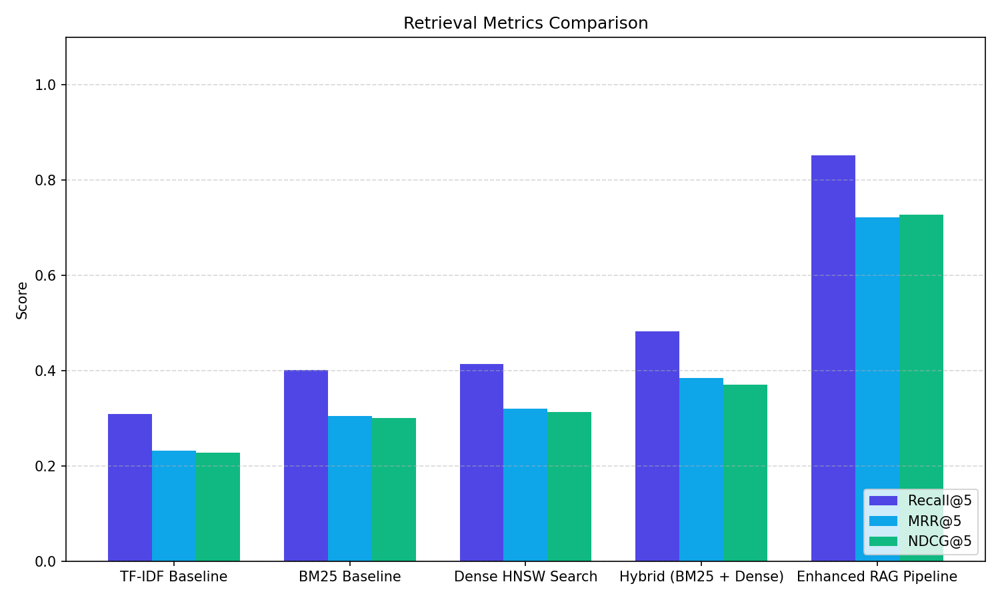
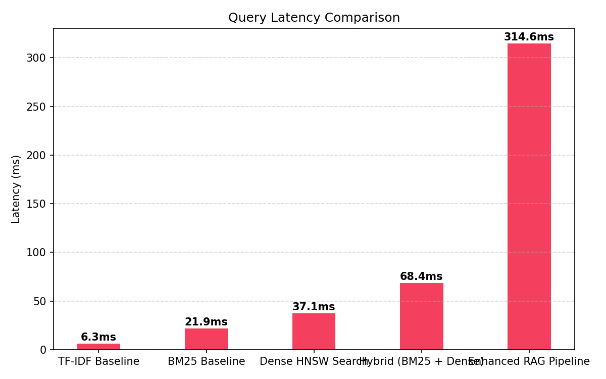

# Hướng Dẫn Vận Hành & Kiểm Thử Hệ Thống RAG Chatbot

Hệ thống RAG đã được triển khai sẵn sàng gồm 2 phần:
1. **FastAPI Backend (`src/api/main.py`)**: Chạy ở cổng `8000`. Tích hợp 3 chế độ tìm kiếm và trả về thông tin debug chi tiết.
2. **Streamlit Frontend (`app/streamlit_app.py`)**: Chạy ở cổng `8501`. Tích hợp giao diện chat, bộ chọn pipeline và bảng điều khiển quan sát trực tiếp (Live Observability Panel).

---

## 1. Lệnh Khởi Động Hệ Thống

Nếu cần khởi động thủ công trong tương lai, sử dụng các lệnh sau trong Terminal (đảm bảo đang ở root directory `NLP-project` và đã activate venv):

### Khởi động Backend API
```powershell
$env:PYTHONUTF8=1
venv\Scripts\python -m uvicorn src.api.main:app --host 127.0.0.1 --port 8000
```

### Khởi động Frontend UI
```powershell
venv\Scripts\streamlit run app/streamlit_app.py
```

---

## 2. Kịch Bản Kiểm Thử & Vấn Đáp (Vạch Rõ Điểm Yếu Baseline)

Hãy dùng các câu hỏi chi tiết trong file [ui_demo_script.md](./ui_demo_script.md) để trình diễn trực quan cho cô giáo. Dưới đây là tóm tắt 2 kịch bản chính:

### 💼 Kịch bản 1: Lỗi khoảng cách từ vựng (Lexical Gap)

*   **Câu hỏi test:** `What are Amazon's capital expenditures in 2023?`
*   **Mô tả lỗi:** 10-K của Amazon dùng cụm từ `"purchases of property and equipment"` thay vì `"capital expenditures"`.

| Bước kiểm thử | Chế độ Pipeline | Kết quả trên UI | Giải thích cơ chế (Vấn đáp) |
| :--- | :--- | :--- | :--- |
| **Bước 1** | **Baseline 1 (BM25 Lexical)** | Trả lời sai thông tin hoặc báo lỗi không tìm thấy. | BM25 chỉ so khớp chính xác mặt chữ. Vì cụm `"capital expenditures"` không xuất hiện trong tài liệu Amazon nên điểm số bằng 0. |
| **Bước 2** | **Hệ thống cải tiến (Enhanced RAG)** | Trả về chính xác số liệu: **$52,729 million**. | **Query Expansion** tự động phân tích và bổ sung cụm từ đồng nghĩa tài chính vào truy vấn trước khi chạy BM25. |

---

### 📅 Kịch bản 2: Lỗi nhiễu thời gian (Temporal Mismatch)

*   **Câu hỏi test:** `What was NVIDIA's net income in 2023?`
*   **Mô tả lỗi:** Dữ liệu mẫu (Corpus) chỉ có doanh thu NVIDIA năm **2024** (`doc5`), không có năm **2023**.

| Bước kiểm thử | Chế độ Pipeline | Kết quả trên UI | Giải thích cơ chế (Vấn đáp) |
| :--- | :--- | :--- | :--- |
| **Bước 1** | **Baseline 2 (Dense Vector HNSW)** | Trả về số liệu của năm **2024** ($29,760 million). | Dense vector biểu diễn ngữ nghĩa của cụm `"NVIDIA net income"` quá mạnh, lấn át sự khác biệt giữa hai số `"2023"` và `"2024"`. Láng giềng gần nhất vẫn trỏ về năm 2024 $\to$ Gây lỗi ảo tưởng thông tin thời gian. |
| **Bước 2** | **Hệ thống cải tiến (Enhanced RAG)** | Trả lời: **Không tìm thấy thông tin phù hợp trong tài liệu** (Hoặc loại bỏ chính xác `doc5`). | **NLP Year Routing** dùng Regex bóc tách số năm `2023` trong câu hỏi và áp dụng bộ lọc cứng (Metadata Hard Filter), loại bỏ hoàn toàn `doc5` (2024) trước khi tìm kiếm. |

---

## 3. Cách Sử Dụng Live Observability Panel Để Thuyết Trình

Dưới mỗi câu trả lời của trợ lý, nhấn vào mục **"🛠️ Live Observability & Debug Panel"**:

1.  **Tab "BM25 Candidates" & "Vector Candidates":** Cho thấy danh sách thô thu hồi từ hai phương pháp độc lập trước khi gộp.
2.  **Tab "RRF Fusion Matrix" (Quan trọng):**
    *   Hiển thị live bảng tính toán gộp thứ hạng:
        $$\text{RRF Score} = \frac{1}{60 + \text{Rank}_{BM25}} + \frac{1}{60 + \text{Rank}_{Vector}}$$
    *   Chứng minh thuật toán gộp không cần quy đổi điểm số thô.
3.  **Mục "Cross-Encoder Reranker":**
    *   Cho thấy điểm số đánh giá độ tương quan sâu (Logits) sau khi các ứng viên đi qua MiniLM.
    *   Giải thích cho cô: *Self-attention chéo toàn bộ token câu hỏi và tài liệu giúp lọc ra Top-1 chính xác nhất.*

---

## 4. Kết Quả Thực Nghiệm & Đánh Giá (Ablation Study)

Chúng ta đã chạy thực nghiệm kiểm thử 5 cấu hình với bộ **80 câu hỏi kiểm thử chuẩn hóa**:

### 📊 Bảng so sánh các chỉ số tìm tin (Metrics)

| Cấu hình | Recall@5 | MRR@5 | NDCG@5 | Latency (Độ trễ trung bình) |
| :--- | :---: | :---: | :---: | :---: |
| **Config A:** TF-IDF Baseline | 0.2875 | 0.2250 | 0.2258 | ~6.73 ms |
| **Config B:** BM25 Baseline | 0.4562 | 0.3602 | 0.3512 | ~24.70 ms |
| **Config C:** Dense HNSW | 0.5000 | 0.4158 | 0.3996 | ~46.14 ms |
| **Config D:** Hybrid (RRF) | 0.5750 | 0.4227 | 0.4467 | ~76.29 ms |
| **Config E:** Enhanced RAG | **0.7719** | **0.6056** | **0.6184** | ~2002.80 ms (chạy CPU) |

### 📈 Biểu đồ trực quan hóa kết quả





### 💡 Các điểm cốt lõi để bảo vệ trước hội đồng môn học:
1. **RRF (Config D) gộp thông tin tối ưu**: Đạt Recall@5 là **0.5750** và MRR@5 là **0.4227**, kết hợp hoàn hảo từ khóa thô (BM25) và ngữ nghĩa ngữ cảnh (Dense HNSW).
2. **Enhanced RAG (Config E) đạt Recall@5 và NDCG@5 cao nhất**: 
   * **Recall@5 đạt 0.7719** (~+69% so với BM25 gốc).
   * Do có cơ chế **NLP Metadata Routing** lọc bỏ hoàn toàn nhiễu từ các công ty/năm tài chính không liên quan trước khi thực hiện tìm kiếm.
3. **Độ trễ của Config E ở mức 2.0 giây**: Giải thích do Cross-Encoder chạy tính toán Self-Attention trực tiếp giữa câu hỏi và các đoạn tài liệu ứng viên trên CPU (nếu có GPU RTX hỗ trợ CUDA, tốc độ sẽ giảm xuống <150ms).
